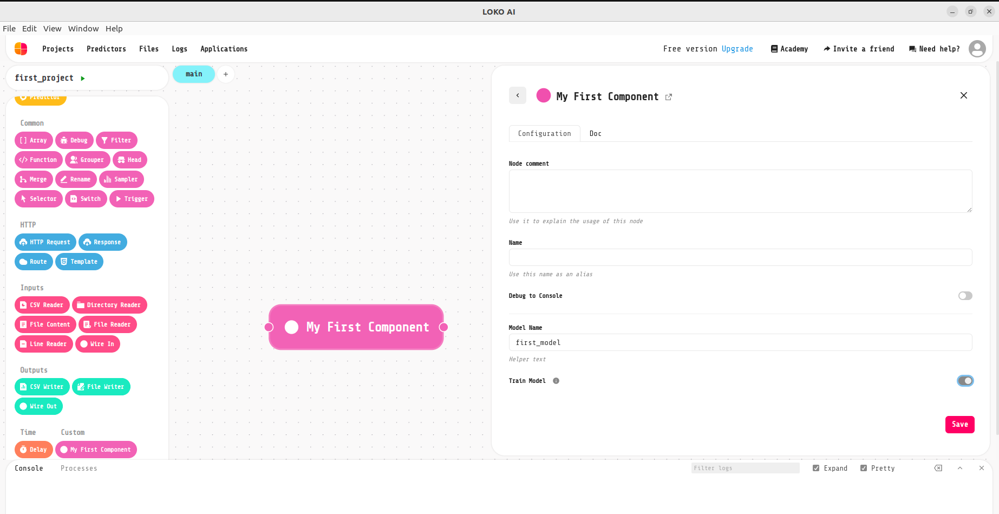
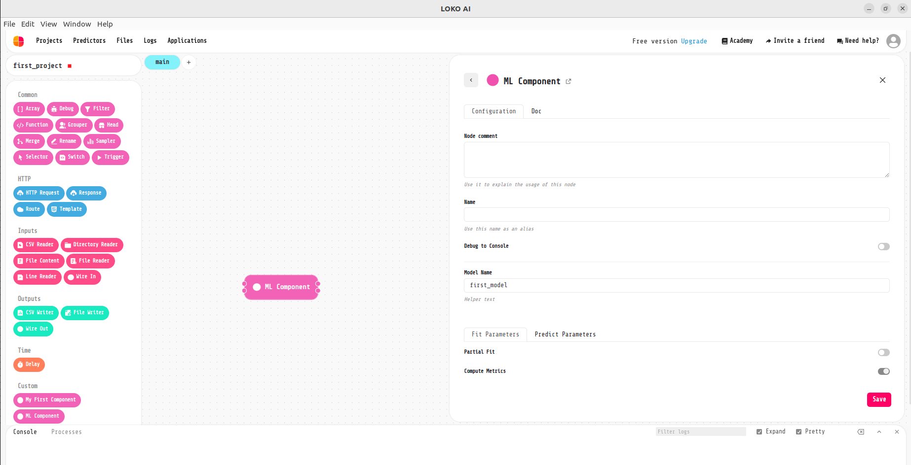
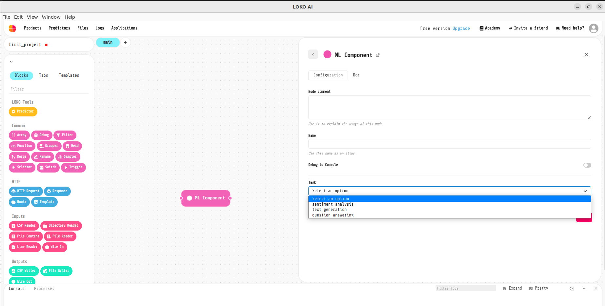

Components
==========

Get started with Components
---------------------------

Components in loko are saved into:

.. code-block:: console

    Home/loko/projects/<yourprojectname>/extensions/components.json

You can create a new script into your project.

For Example:

.. code-block:: console

    Home/loko/projects/<yourprojectname>/business/create_components.py

>>> from loko_extensions.model.components import Arg, Component, save_extensions
>>> model_name = Arg(name="model_name", type="text", label="Model Name", helper="Helper text")
>>> train = Arg(name="train", type="boolean", label="Train Model", description="Helper text")
>>> comp1 = Component(name="My First Component", args=[model_name, train])
>>> save_extensions([comp1])

When you run the script, it'll update your file ``components.json``.

If you open your project using Loko, you'll find your first component: ``My First Component``.
You can drag and drop the component into your project and double click on it.

Inputs/Outputs
----------------

Components' inputs are linked to your services. Let's create a new service into:

.. code-block:: console

    Home/loko/projects/<yourprojectname>/services/services.py

If you want to change your services path, remember also to change it into your ``Dockerfile``.

For Example:

>>> @bp.post('/myfirstservice')
>>> @doc.consumes(doc.JsonBody({}), location="body")
>>> @extract_value_args()
>>> async def f(value, args):
>>>     return sanic.json(dict(msg="Hello world!"))

You can now add :py:meth:`~loko_extensions.model.components.Input` and :py:meth:`~loko_extensions.model.components.Output` to your first component:

>>> from loko_extensions.model.components import Arg, Component, save_extensions, Input, Output
>>> model_name = Arg(name="model_name", type="text", label="Model Name", helper="Helper text")
>>> train = Arg(name="train", type="boolean", label="Train Model", description="Helper text")
>>> input1 = Input(id='input', label='Input', service='myfirstservice', to='output')
>>> output1 = Output(id='output', label='Output')
>>> comp1 = Component(name="My First Component", args=[model_name, train],
>>>                   inputs=[input1], outputs=[output1])
>>> save_extensions([comp1])

``label`` represents the visualized name in Loko. By default, it is set to the id value.
``to`` represents the link between input and output.

- Note that in ``service`` the first ``/`` is skipped.

Arguments
----------------
We saw in the first example a of *text* and *boolean* :py:meth:`~loko_extensions.model.components.Arg`.
Available types are: “text”, “boolean”, “number”, “path”, “files”.
You can add arguments' explanation using ``description`` or ``helper``.
In the first case you'll find the information symbol, in the second one the description will be explicitly written near
to the argument name. ``group`` is used to group arguments into different tabs.

Let's see an Example:

>>> model_name = Arg(name="model_name", type="text",
>>>                  label="Model Name", helper="Helper text")
>>> partial = Arg(name="partial", type="boolean", label="Partial Fit",
>>>               group='Fit Parameters', value=False)
>>> metrics = Arg(name="metrics", type="boolean", label="Compute Metrics",
>>>               group='Fit Parameters', value=True)
>>> proba = Arg(name="proba", type="boolean", label="Predict Proba",
>>>             group='Predict Parameters', value=True)
>>> fit_input = Input(id='fit', label='Fit', service='fitservice', to='fit')
>>> fit_output = Output(id='fit', label='Fit')
>>> predict_input = Input(id='predict', label='Predict', service='predictservice', to='predict')
>>> predict_output = Output(id='predict', label='Predict')
>>> comp2 = Component(name="ML Component",
>>>                   args=[model_name, partial, metrics, proba],
>>>                   inputs=[fit_input, predict_input],
>>>                   outputs=[fit_output, predict_output])
>>> save_extensions([comp1, comp2])

In this case we'll have two different tabs: *Fit Parameters* and *Predict Parameters*.
You can use ``value`` to set default value for the argument.

You can also create :py:meth:`~loko_extensions.model.components.Select` arguments.
Select arguments allow to set all the values that an argument can assume, using ``options``.
Example:

>>> task = Select(name="task", label="Task", options=["sentiment analysis",
>>>               "text generation", "question answering"])
>>> comp1 = Component(name="ML Component", args=[task])
>>> save_extensions([comp1])

Finally, :py:meth:`~loko_extensions.model.components.Dynamic` arguments are used to dynamically show a parameter’s
configuration.

Example:

>>> task = Select(name="task", label="Task", group="Task Settings",
>>>               options=["sentiment analysis", "text generation", "question answering"])
>>> max_length = Dynamic(name="max_length", label="Max Length", dynamicType="number",
>>>                      parent="task", group="Task Settings", value=30,
>>>                      condition="{parent}===\"text generation\"")
>>> comp1 = Component(name='ML Component', args=[task, max_length])
>>> save_extensions([comp1])

*Max Length* is a specific parameter used by the text generation task.
It is a number field (i.e. ``"dynamicType"="number"``), depends on Task value (i.e. ``"parent"="task"``)
and it'll be displayed only when Task is set to text generation (i.e. ``"condition"="{parent}===\"text generation\""``).