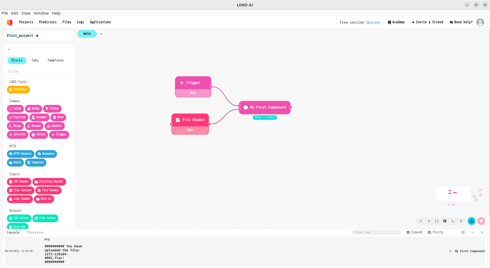
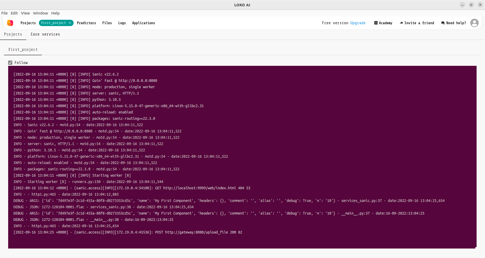

Decorators
==========

In order to link the Loko's components to your services you have to create ``POST`` methods.
You can use :py:meth:`~loko_extensions.business.decorators.extract_value_args` to extract value and args from services.
It works both with Flask and Sanic frameworks.

Example:

>>> # using Flask
>>> import json
>>>
>>> from flask import Flask, request, jsonify
>>> from loko_extensions.business.decorators import extract_value_args
>>>
>>> from utils.logger_utils import stream_logger
>>>
>>> logger = stream_logger(__name__)
>>>
>>> app = Flask("")
>>>
>>> @app.route("/myfirstservice", methods=["POST"])
>>> @extract_value_args(_request=request)
>>> def f(value, args):
>>>     logger.debug(f'ARGS: {args}')
>>>     logger.debug(f'JSON: {value}')
>>>     n = int(args.get('n'))
>>>     return jsonify(dict(msg=f"{'#'*n} Hello world! {'#'*n}"))
>>>
>>> @app.route("/upload_file", methods=["POST"])
>>> @extract_value_args(_request=request, file=True)
>>> def f2(file, args):
>>>     logger.debug(f'ARGS: {args}')
>>>     logger.debug(f'JSON: {file.filename}')
>>>     n = int(args.get('n'))
>>>     return jsonify(dict(msg=f"{'#'*n} You have uploaded the file: {file.filename}! {'#'*n}"))
>>>
>>> if __name__ == "__main__":
>>>     app.run("0.0.0.0", 8080)

``_request`` is the Flask request while ``file=True`` extracts files from body.

>>> # using Sanic
>>> import json
>>> import traceback
>>>
>>> import sanic
>>> from sanic import Sanic, Blueprint
>>> from sanic.exceptions import NotFound
>>> from sanic_openapi import swagger_blueprint
>>>
>>> from loko_extensions.business.decorators import extract_value_args
>>> from utils.logger_utils import stream_logger
>>>
>>> logger = stream_logger(__name__)
>>>
>>> def get_app(name):
>>>     app = Sanic(name)
>>>     swagger_blueprint.url_prefix = "/api"
>>>     app.blueprint(swagger_blueprint)
>>>     return app
>>>
>>>
>>> name = "first_project"
>>> app = get_app(name)
>>> bp = Blueprint("default", url_prefix=f"/")
>>> app.config["API_TITLE"] = name
>>>
>>> @bp.post('/myfirstservice')
>>> @extract_value_args()
>>> async def f(value, args):
>>>     logger.debug(f'ARGS: {args}')
>>>     logger.debug(f'JSON: {value}')
>>>     n = int(args.get('n'))
>>>     return sanic.json(dict(msg=f"{'#'*n} Hello world! {'#'*n}"))
>>>
>>> @bp.post('/upload_file')
>>> @extract_value_args(file=True)
>>> async def f2(file, args):
>>>     logger.debug(f'ARGS: {args}')
>>>     logger.debug(f'JSON: {file[0].name}')
>>>     n = int(args.get('n'))
>>>     return sanic.json(dict(msg=f"{'#'*n} You have uploaded the file: {file[0].name}! {'#'*n}"))
>>>
>>> @app.exception(Exception)
>>> async def manage_exception(request, exception):
>>>     e = dict(error=str(exception))
>>>     if isinstance(exception, NotFound):
>>>         return sanic.json(e, status=404)
>>>     logger.error('TracebackERROR: \n' + traceback.format_exc() + '\n\n')
>>>     status_code = exception.status_code or 500
>>>     return sanic.json(e, status=status_code)
>>>
>>>
>>> app.blueprint(bp)
>>>
>>> app.run("0.0.0.0", port=8080, auto_reload=True)

When you use Sanic ``_request`` is None.

Services must run on host ``"0.0.0.0"`` and port ``8080``.

``args`` is a dictionary containing the component's confuguration.

In this example we also have to create a component containing argument ``n``
(see the previous section :ref:`Components`)

>>> from loko_extensions.model.components import Arg, Component, save_extensions, Input, Output, Select, Dynamic
>>>
>>> n = Arg(name='n', type='number', helper='Number of # in the output', value=1)
>>> input = Input(id='input', label='Input', service='myfirstservice', to='output')
>>> output = Output(id='output', label='Output')
>>> input_f = Input(id='file', label='File', service='upload_file', to='output')
>>> comp1 = Component(name='My First Component', args=[n], inputs=[input, input_f], outputs=[output])
>>> save_extensions([comp1])

Run the last script (e.g. `Home/loko/projects/<yourprojectname>/business/create_components.py`) to update the
``components.json`` file. Then on Loko run your project in order to build and execute the new component's image.
Use `crtl-R` to refresh the application and you'll find the new block: ``My First Component``. You can drag and drop
the component into your project and use it!

You can finally open the ``Logs`` tab and check that everything is working fine.

